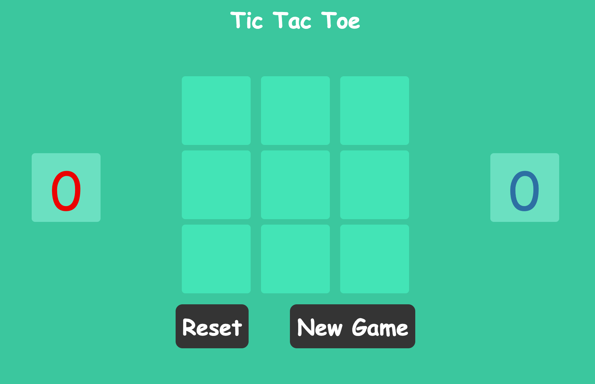

<!-- md -> markdown -->
<!-- Github markdown -->

# Tic Tac Toe
The famous, exciting and amazing Tic Tac Toe is now on a webpage for you and a friend to battle over the title of the "King of TTT".

## Project Deployment
[Play Now](https://ahmedalnemer.github.io/project-1/)

<!-- Tech list -->
## Techonology Stack
* HTML5
* CSS3
* JAVASCRIPT
* JQUERY

## ScreenShot
<!-- Image -->

## Wireframes and User stories.
* The users open the webpage to find the game ready to be played
* The users choose a cell to place thier letter into
* The users can not choose a cell that has already been chosen
* The users alternate turns until the game is finished
* In case of a win there is an animation that shows the winning line as well as some positive sound effects
* In case of a Tie there is an indecator that shows that and a negative sound effect
* The points for the approriate winner will be incremented
* The users can then hit the reset button to play another round
* The users can also hit the new game button to start a new game with cleared scoreboard

## Planning and Development Process
#### Day 1
* Implemented the starter HTML and CSS
* Researched Algorithms for deciding the winner

#### Day 2
* Implemented the game logic
* Improved the styling by adding responsive design

#### Day 3
* Improved the game logic
* Added animations
* Added sound effects

#### Day 4
* Applied the finishing touchs
* Tested all possible scenarios

## Challenges
* Making the webpage responsive for all devices
* The game logic only works on 3x3 grid so making a costumized grid size was not possible with the game logic I used

## Unsolved problems which would be fixed in future iterations.
* Implemeting logic that works with larger grids
* Making a bot that users can play against
